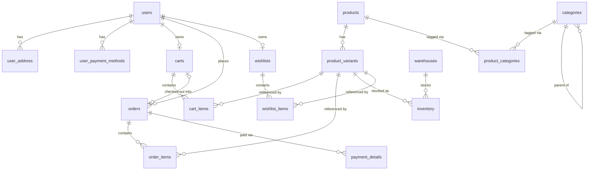

# Database Schema Documentation

## Overview

Schema is managed via Flyway migrations. Flyway is the single source of truth
for the database structure — JPA/Hibernate is configured with
`ddl-auto: validate` and never generates or alters schema itself.

Currently in dev mode: existing migrations may still be edited in place
(database is recreated from scratch). Once the project moves to a
staging/production-like environment, migrations become append-only —
schema changes must be new `V{n}__...sql` files instead.

## Migration Files

| File | Tables Created | Depends On |
|---|---|---|
| `V0__init_functions.sql` | — (defines `set_updated_at()` trigger function) | — |
| `V1__create_users.sql` | `users`, `user_address`, `user_payment_methods` | `V0` (trigger function) |
| `V2__create_products.sql` | `products`, `product_variants` | `V0` |
| `V3__create_carts.sql` | `carts`, `cart_items` | `V1` (users), `V2` (product_variants) |
| `V4__create_payments.sql` | `orders`, `order_items`, `payment_details` | `V1` (users), `V2` (product_variants), `V3` (carts) |
| `V5__create_categories.sql` | `categories`, `product_categories` | `V2` (products) |
| `V6__create_inventory.sql` | `warehouses`, `inventory` | `V2` (product_variants) |
| `V7__create_wishlist.sql` | `wishlists`, `wishlist_items` | `V1` (users), `V2` (product_variants) |

Every foreign key either points to a table created in an earlier migration
file, or to a table created earlier within the same file. There are no
forward references.

## Entity Relationship Diagram

## Tables

### users / user_address / user_payment_methods
Core account data. A user has zero or more addresses and saved payment
methods. `users.role` is a native Postgres enum (`admin`, `user`, `support`).

### products / product_variants
`products` holds the shared identity of an item (name, description).
`product_variants` holds the purchasable SKUs — price, physical attributes
(`weight_grams`, `barcode`), and free-form `attributes` (`jsonb`, GIN-indexed)
for category-specific specs like color or size that don't warrant dedicated
columns. `is_active` allows soft-disabling a variant without deleting it.

Stock is **not** tracked here — see `inventory`.

### categories / product_categories
`categories` is self-referencing (`parent_id`) to support arbitrary-depth
sub-categories rather than a fixed two-level split. `product_categories` is
the many-to-many join between products and categories.

### carts / cart_items
A user's in-progress selection before checkout. No uniqueness constraint on
`carts.user_id` — a user can have multiple carts over time (e.g. a new one
after each completed order).

> **Design note:** an earlier version had `UNIQUE` on both `carts.user_id`
> and `orders.cart_id`, which limited each user to exactly one order for the
> lifetime of their account. Both constraints were removed for this reason.

### orders / order_items / payment_details
`orders.cart_id` is a nullable, non-unique reference to the cart it
originated from — informational only. The actual purchased items are
snapshotted into `order_items` (quantity + `price_at_purchase`) at checkout
time, so later price changes on `product_variants` never affect order
history. `orders.total_amount` is stored directly rather than derived via
`SUM(order_items)`, since order total is an immutable historical fact and
this avoids a join on every order-list query.

`payment_details` records one or more payment attempts against an order
(`payment_status`: `SUCCESS` / `FAILED` / `PENDING`).

### warehouses / inventory
Stock is tracked per warehouse. `inventory` has a unique
`(product_variant_id, warehouse_id)` pair — total stock for a variant is the
sum of its rows across warehouses. This replaced the earlier
`product_variants.stock_quantity` column to avoid two sources of truth for
stock once multi-warehouse tracking was introduced.

### wishlists / wishlist_items
One wishlist per user (`UNIQUE` on `user_id` is safe here, unlike carts,
because a wishlist isn't "consumed" by a purchase).

## Known Open Points

- **Native Postgres enums vs JPA**: `user_role`, `payment_status`, and
  `order_status` are native Postgres `ENUM` types. Hibernate's default
  `@Enumerated(EnumType.STRING)` maps to `varchar`, not a native enum, which
  will fail `ddl-auto: validate`. Either map explicitly with
  `@JdbcTypeCode(SqlTypes.NAMED_ENUM)` (Hibernate 6+), or switch these
  columns to `varchar` + `CHECK` constraint for simpler JPA compatibility.
- **`product_variants.attributes` (`jsonb`)**: flexible but unvalidated at
  the DB level — worth enforcing structure at the application layer per
  category if this grows.