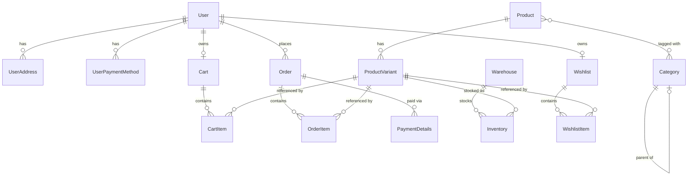

# GraphQL API

## Overview

The API is served over a single GraphQL endpoint (`/graphql`) via Netflix
DGS on top of Spring GraphQL. There is no REST API for these domains —
`api-design.md` in this directory describes an earlier REST-based design
that was superseded by this schema.

Schema files live under `backend/src/main/resources/schema/`, one directory
per domain, split by convention into:

| File | Contents |
|---|---|
| `<domain>.graphqls` | object/enum type definitions |
| `<domain>.queries.graphqls` | `extend type Query { ... }` |
| `<domain>.mutations.graphqls` | inputs + `extend type Mutation { ... }` |
| `<domain>.subscriptions.graphqls` | `extend type Subscription { ... }` (payment only, see below) |

`schema.graphqls` declares the three empty root types (`Query`, `Mutation`,
`Subscription`) that every domain file extends.

## Scalars

Defined in `scalars.graphqls`, realized by `graphql-java-extended-scalars`
plus two hand-written coercions in `graphql/scalars/`:

| Scalar | Maps to | Coercion |
|---|---|---|
| `UUID` | `java.util.UUID` | extended-scalars |
| `BigDecimal` | `java.math.BigDecimal` | extended-scalars |
| `JSON` | `Map<String, Object>` | extended-scalars |
| `Url` | — (unused so far) | extended-scalars |
| `Instant` | `java.time.Instant` | `InstantScalar` |
| `LocalDate` | `java.time.LocalDate` | `LocalDateScalar` |

## Authorization conventions

Operations come in two shapes:

- **`my`-prefixed / no-id** (`myCart`, `myOrders`, `myWishlist`,
  `addMyAddress`, ...) — act on the authenticated caller, resolved from the
  security context, not from a client-supplied id.
- **Explicit id, `User`-suffixed** (`addUserAddress`, `updateUserRole`, ...)
  — admin/support operations that act on an arbitrary user, gated by
  `Role` (`ADMIN`, `USER`, `SUPPORT`).

Root query/mutation authorization itself (which `Role` may call which
operation) is not yet implemented — see Known Open Points.

## Domains

### User (`user/`)

Types: `User`, `UserAddress`, `UserPaymentMethod`, enum `Role`.

| Query | Returns |
|---|---|
| `me` | `User!` — the authenticated caller |
| `user(id: ID)` | `User!` |

| Mutation | Returns |
|---|---|
| `createUser(input: CreateUserInput!)` | `User!` |
| `addMyAddress` / `updateMyAddress` / `deleteMyAddress` | `UserAddress!` / `UserAddress!` / `Boolean!` |
| `addMyPaymentMethod` / `deleteMyPaymentMethod` | `UserPaymentMethod!` / `Boolean!` |
| `addUserAddress` / `updateUserAddress` / `deleteUserAddress` | admin/support equivalents, take `userId` |
| `updateUserRole(userId, input: UpdateRoleInput)` | `User!` |
| `addUserPaymentMethod` / `deleteUserPaymentMethod` | admin/support equivalents, take `userId` |

`UserPaymentMethod.type` and `UserPaymentMethod.provider` are distinct:
`provider` is a free-text vendor label (e.g. `"mastercard"`), `type` is the
constrained `PaymentMethodType` enum (defined in the payment domain, see
below) describing the kind of instrument (`CARD`, `BANK_TRANSFER`, ...).

### Product (`product/`)

Types: `Product`, `ProductVariant`.

| Query | Returns |
|---|---|
| `product(id: ID, slug: String)` | `Product` |
| `products` | `[Product!]!` |

`Product.variants` requires a custom resolver (no such collection exists on
the `Product` entity — it's loaded via `ProductVariantRepository.findAllByProductId`).
`Product.categories` resolves via the entity's own `Set<Category>` field.

| Mutation | Returns |
|---|---|
| `createProduct` / `updateProduct` / `deleteProduct` | `Product!` / `Product!` / `Boolean!` |
| `createProductVariant` / `updateProductVariant` / `deleteProductVariant` | `ProductVariant!` / `ProductVariant!` / `Boolean!` |

### Category (`category/`)

Types: `Category` (self-referencing via `parent: Category`).

| Query | Returns |
|---|---|
| `category(id: ID, slug: String)` | `Category` |
| `categories` | `[Category!]!` |

| Mutation | Returns |
|---|---|
| `createCategory` / `updateCategory` / `deleteCategory` | `Category!` / `Category!` / `Boolean!` |

No dedicated query for sub-categories — traverse via `Category.parent`, or
filter client-side; a top-level `category.children` field can be added if a
concrete access pattern needs it.

### Inventory (`inventory/`)

Types: `Warehouse`, `Inventory`.

This domain has no natural root query fitting the entity itself (an
`Inventory` row isn't meaningful in isolation), so it's exposed only as a
nested field on the two things it relates:

- `extend type Warehouse { inventory: [Inventory!]! }`
- `extend type ProductVariant { inventory: [Inventory!]! }`

| Query | Returns |
|---|---|
| `warehouse(id: ID!)` | `Warehouse` |
| `warehouses` | `[Warehouse!]!` |

| Mutation | Returns |
|---|---|
| `createWarehouse` / `updateWarehouse` / `deleteWarehouse` | `Warehouse!` / `Warehouse!` / `Boolean!` |
| `setInventory(input: SetInventoryInput!)` | `Inventory!` — upserts the `(productVariantId, warehouseId)` row to an absolute quantity |

### Cart (`cart/`)

Types: `Cart`, `CartItem`. No root id-based query — a user has at most one
active cart, reached only via `myCart`.

| Query | Returns |
|---|---|
| `myCart` | `Cart!` |

| Mutation | Returns |
|---|---|
| `addCartItem` / `updateCartItem` / `removeCartItem` | `CartItem!` / `CartItem!` / `Boolean!` |
| `clearCart` | `Boolean!` |

### Wishlist (`wishlist/`)

Types: `Wishlist`, `WishlistItem`. Same shape as Cart — one per user,
reached only via `myWishlist`.

| Query | Returns |
|---|---|
| `myWishlist` | `Wishlist!` |

| Mutation | Returns |
|---|---|
| `addWishlistItem` / `removeWishlistItem` | `WishlistItem!` / `Boolean!` |

### Payment (`payment/`)

Types: `Order`, `OrderItem`, `PaymentDetails`, enums `OrderStatus`,
`PaymentStatus`, `PaymentMethodType`.

| Query | Returns |
|---|---|
| `order(id: ID, publicId: UUID)` | `Order` |
| `myOrders` | `[Order!]!` |

| Mutation | Returns |
|---|---|
| `createOrder` | `Order!` — checks out the caller's current cart, no input needed |
| `updateOrderStatus(orderId, input: UpdateOrderStatusInput!)` | `Order!` |
| `createPayment(input: CreatePaymentInput!)` | `PaymentDetails!` |
| `updatePaymentStatus(paymentId, input: UpdatePaymentStatusInput!)` | `PaymentDetails!` |

| Subscription | Returns |
|---|---|
| `orderStatusChanged(orderId: ID!)` | `Order!` |

Payment is the only domain with a subscription: order status changes
(`PENDING → PAID → SHIPPING → ...`) are the one place in this schema where a
client genuinely benefits from a live push instead of polling. No other
domain currently has an equivalent real-time use case.

## Type relationships

## Known Open Points

- **No resolvers implemented yet.** Every `@DgsComponent` class under
  `graphql/datafetchers/` is currently an empty stub (`UserDataFetcher`,
  `ProductDataFetcher`, ...). Root query/mutation/subscription fields fall
  through to the default `PropertyDataFetcher`, which resolves to `null` and
  fails GraphQL's non-null validation for almost every field in this
  document. This is intentional, TDD-driven RED state — corresponding tests
  exist under `backend/src/test/.../graphql/datafetchers/`.
- **No `DataLoader`s.** Nested list fields (`Product.variants`,
  `Warehouse.inventory`, `User.addresses`, ...) will N+1 once implemented
  naively across a list of parents. Not addressed yet since no real access
  pattern has demonstrated the problem.
- **Root-level authorization is unenforced in the schema.** The `my`- vs.
  `User`-suffixed split above is a naming convention, not an enforced
  contract — authorization will need to be implemented in the resolvers
  (or via a security layer) once GREEN work starts.
- **`createOrder` cart→order mapping is unspecified.** The mutation takes no
  input and is expected to derive its `OrderItem`s from the caller's current
  `Cart`, but the exact transition (e.g. whether the cart is cleared,
  whether an empty cart is a valid checkout) isn't decided yet.
