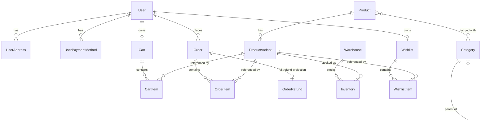

# GraphQL API

## Overview

The API is served over a single GraphQL endpoint (`/graphql`) via Netflix
DGS on top of Spring GraphQL. There is no REST API for these domains —
`api-design.md` in this directory describes an earlier REST-based design
that was superseded by this schema.

Schema files live under `backend/src/main/resources/schema/`, one directory
per domain, split by convention into:

| File | Contents |
|---|---|
| `<domain>.graphqls` | object/enum type definitions |
| `<domain>.queries.graphqls` | `extend type Query { ... }` |
| `<domain>.mutations.graphqls` | inputs + `extend type Mutation { ... }` |
| `<domain>.subscriptions.graphqls` | `extend type Subscription { ... }` (payment only, see below) |

`schema.graphqls` declares the three empty root types (`Query`, `Mutation`,
`Subscription`) that every domain file extends.

The [Checkout API](checkout.md) documents the current authenticated/guest
checkout contract in `payment/checkout.graphqls`. Public `createOrder` now
requires `PlaceOrderInput`; no-input placement is intentionally unavailable.
`Order.checkout`/`OrderItem.snapshot` expose historical snapshots where known;
`Order.user` is nullable for guest orders. Guest confirmation uses a separate
snapshot-only projection and protected HttpOnly credential.

## Scalars

Defined in `scalars.graphqls`, realized by `graphql-java-extended-scalars`
plus two hand-written coercions in `graphql/scalars/`:

| Scalar | Maps to | Coercion |
|---|---|---|
| `UUID` | `java.util.UUID` | extended-scalars |
| `BigDecimal` | `java.math.BigDecimal` | extended-scalars |
| `JSON` | `java.lang.Object` (native JSON values) | extended-scalars |
| `Url` | — (unused so far) | extended-scalars |
| `Instant` | `java.time.Instant` | `InstantScalar` |
| `LocalDate` | `java.time.LocalDate` | `LocalDateScalar` |

Product variant `attributes` must be a JSON object with string keys; nested
objects, arrays and primitive values are supported. Literal and variable
inputs round-trip as ordinary JSON, not Jackson node metadata. Omitted
attributes remain an empty object. Generated scalar bindings use `Object`
because extended-scalars produces native maps/lists, not Jackson tree nodes.

## Authorization conventions

Operations come in two shapes:

- **`my`-prefixed / no-id** (`myCart`, `myOrders`, `myWishlist`,
  `addMyAddress`, ...) — act on the authenticated caller, resolved from the
  security context, not from a client-supplied id.
- **Explicit id, `User`-suffixed** (`addUserAddress`, `updateUserRole`, ...)
  — admin/support operations that act on an arbitrary user, gated by
  `Role` (`ADMIN`, `USER`, `SUPPORT`).

Root query/mutation access is enforced on data-fetcher methods using the
existing OAuth scopes; public catalog exceptions are narrowly defined below.

### Public catalog discovery

Credential-free JSON POST queries may select only these catalog discovery roots:
`product`, `products`, `category`, `categories`, `searchProducts`, and
`productSearchSuggestions`. They do not require an `Origin` or
`X-Guest-Cart-Request` header. Public listing clients should use bounded
`searchProducts`; `products` remains unbounded.

The selected GraphQL operation is classified by its parsed operation AST, including
`operationName`, aliases, and fragments. A public catalog operation cannot combine
catalog roots with guest-cart roots; the backend rejects that document with a
client-visible GraphQL error. Anonymous catalog-plus-protected-root documents are
also rejected explicitly. Authenticated catalog access continues to require the
existing `product:read` or `category:read` scope, and catalog writes remain protected.

`Product.variants`, `Product.categories`, `ProductVariant.product`, and
`Category.parent` are customer-readable. `ProductVariant.inventory`, warehouse roots,
and inventory-management fields continue to require `warehouse:read`; no warehouse
quantities or derived availability signal are public. User, cart, and order data keep
their existing authentication, scope, and ownership protections.

Only a credential- and cookie-free, pure public catalog query is marked
`Cache-Control: public, max-age=60`, with `Vary: Origin, Authorization, Cookie`.
Authenticated or cookie-bearing catalog requests, guest operations, and protected
responses remain private/no-store. Cached catalog prices are display data only;
cart and checkout continue to use authoritative current prices and validation.

## Domains

### User (`user/`)

Types: `User`, `UserAddress`, `UserPaymentMethod`, enum `Role`.

| Query | Returns |
|---|---|
| `me` | `User!` — the authenticated caller |
| `user(id: ID)` | `User!` |

| Mutation | Returns |
|---|---|
| `createUser(input: CreateUserInput!)` | `User!` |
| `addMyAddress` / `updateMyAddress` / `deleteMyAddress` | `UserAddress!` / `UserAddress!` / `Boolean!` |
| `addMyPaymentMethod` / `deleteMyPaymentMethod` | `UserPaymentMethod!` / `Boolean!` |
| `addUserAddress` / `updateUserAddress` / `deleteUserAddress` | admin/support equivalents, take `userId` |
| `updateUserRole(userId, input: UpdateRoleInput)` | `User!` |
| `addUserPaymentMethod` / `deleteUserPaymentMethod` | admin/support equivalents, take `userId` |

`UserPaymentMethod.type` and `UserPaymentMethod.provider` are distinct:
`provider` is a free-text vendor label (e.g. `"mastercard"`), `type` is the
constrained `PaymentMethodType` enum (defined in the payment domain, see
below) describing the kind of instrument (`CARD`, `BANK_TRANSFER`, ...).

### Product (`product/`)

Types: `Product`, `ProductVariant`.

| Query | Returns |
|---|---|
| `product(id: ID, slug: String)` | `Product` |
| `products` | `[Product!]!` |

`Product.variants` requires a custom resolver (no such collection exists on
the `Product` entity — it's loaded via `ProductVariantRepository.findAllByProductId`).
`Product.categories` resolves via the entity's own `Set<Category>` field.

| Mutation | Returns |
|---|---|
| `createProduct` / `updateProduct` / `deleteProduct` | `Product!` / `Product!` / `Boolean!` |
| `createProductVariant` / `updateProductVariant` / `deleteProductVariant` | `ProductVariant!` / `ProductVariant!` / `Boolean!` |

### Category (`category/`)

Types: `Category` (self-referencing via `parent: Category`).

| Query | Returns |
|---|---|
| `category(id: ID, slug: String)` | `Category` |
| `categories` | `[Category!]!` |

| Mutation | Returns |
|---|---|
| `createCategory` / `updateCategory` / `deleteCategory` | `Category!` / `Category!` / `Boolean!` |

No dedicated query for sub-categories — traverse via `Category.parent`, or
filter client-side; a top-level `category.children` field can be added if a
concrete access pattern needs it.

### Inventory (`inventory/`)

Types: `Warehouse`, `Inventory`.

This domain has no natural root query fitting the entity itself (an
`Inventory` row isn't meaningful in isolation), so it's exposed only as a
nested field on the two things it relates:

- `extend type Warehouse { inventory: [Inventory!]! }`
- `extend type ProductVariant { inventory: [Inventory!]! }`

| Query | Returns |
|---|---|
| `warehouse(id: ID!)` | `Warehouse` |
| `warehouses` | `[Warehouse!]!` |

| Mutation | Returns |
|---|---|
| `createWarehouse` / `updateWarehouse` / `deleteWarehouse` | `Warehouse!` / `Warehouse!` / `Boolean!` |
| `setInventory(input: SetInventoryInput!)` | `Inventory!` — upserts the `(productVariantId, warehouseId)` row to an absolute quantity |

### Cart (`cart/`)

Types: `Cart`, `CartItem`, `GuestCart`, `GuestCartItem`, `CartTotals` and explicit
merge result/conflict types. No root id-based access — public cart IDs are not
credentials. Authenticated carts use `myCart` with `cart:read`; writes require
`cart:write`. Guest operations use a hashed random HttpOnly cookie and strict
Origin/preflight-header checks. Merge requires both scopes and an active owner
derived from the principal.

| Query | Returns |
|---|---|
| `myCart` | `Cart!` |
| `guestCart` | `GuestCart` — null without a credential; never lazily creates |

| Mutation | Returns |
|---|---|
| `addCartItem` / `updateCartItem` / `removeCartItem` | `CartItem!` / `CartItem!` / `Boolean!` |
| `clearCart` | `Boolean!` |
| `startGuestCart` | `StartGuestCartResult!` — reuse valid cart or explicitly start empty |
| `addGuestCartItem` / `updateGuestCartItem` / `removeGuestCartItem` | `GuestCart!` — current items and server totals |
| `mergeGuestCart(requestId: UUID!)` | `GuestCartMergeResult!` — MERGED / REPLAYED / BLOCKED |

Both cart types expose merchandise totals in EUR; item types expose subtotal.
Guest types contain no owner or authenticated cart back-reference. Invalid,
expired and consumed credentials return `GUEST_CART_UNAVAILABLE`. Merge is
transactional and all-or-nothing; no quantities are silently clamped and stock
is still checked only at checkout. See the authoritative [Guest Cart guide](guest-cart.md)
for operation examples, cookie/CORS/CSRF, expiration, replay and configuration.

### Wishlist (`wishlist/`)

Types: `Wishlist`, `WishlistItem`. Same shape as Cart — one per user,
reached only via `myWishlist`.

| Query | Returns |
|---|---|
| `myWishlist` | `Wishlist!` |

| Mutation | Returns |
|---|---|
| `addWishlistItem` / `removeWishlistItem` | `WishlistItem!` / `Boolean!` |

### Payment (`payment/`)

Types: `Order`, `OrderItem`, `CheckoutOrder`, `OrderCancellationPayload`,
`OrderPayment`, `OrderRefund`; enums `OrderStatus`, `OrderPaymentStatus`,
`OrderRefundStatus`, `PaymentMethodType`. Payment processing belongs to the Go
service, not client-assigned GraphQL payment records.

| Query | Returns |
|---|---|
| `order(id: ID, publicId: UUID)` | `Order` |
| `myOrders` | `[Order!]!` |

| Mutation | Returns |
|---|---|
| `createOrder(input: PlaceOrderInput!)` | `Order!` - quoted atomic authenticated checkout |
| `createGuestOrder(input: PlaceOrderInput!)` | `CheckoutOrder!` - protected guest checkout |
| `cancelOrder(input: CancelOrderInput!)` | `OrderCancellationPayload!` - active owner and order:write |
| `cancelGuestOrder(input: CancelOrderInput!)` | `OrderCancellationPayload!` - protected unexpired guest order grant |
| `cancelOrderAsStaff(input: CancelOrderInput!)` | `OrderCancellationPayload!` - staff role and order:manage-status |
| `updateOrderStatus(orderId, input: UpdateOrderStatusInput!)` | `Order!` - confirmed-payment SHIPPING/COMPLETED only |

`Order` and `CheckoutOrder` expose cancellation eligibility, committed
cancellation metadata, payment outcome and asynchronous refund status.
See [Order cancellation](order-cancellation.md) for scopes, state transitions,
request UUID retries, cookie transport, financial uncertainty and full-refund
examples. No createPayment/updatePaymentStatus mutation exists.

| Subscription | Returns |
|---|---|
| `orderStatusChanged(orderId: ID!)` | `Order!` |

Payment is the only domain with a subscription: order status changes
(`PENDING → PAID → SHIPPING → ...`) are the one place in this schema where a
client genuinely benefits from a live push instead of polling. No other
domain currently has an equivalent real-time use case.

`orderStatusChanged` requires `order:read` and the same ownership policy as
`order`: the owner, or an `ORDER_MANAGER`/`ADMIN` caller. Events are not replayed
to new subscribers; disconnecting the last subscriber does not disable future
subscriptions.

Use Hive's `/graphql` SSE transport (`Accept: text/event-stream`) with the
Bearer HTTP header. The current router configuration uses WebSocket upstream
to Spring, not a client-facing WebSocket endpoint. Spring's `/graphql`
WebSocket transport accepts the JWT in either the upgrade header or the
`connection_init` Authorization payload. Missing/invalid initialization
credentials are rejected before subscription execution; ordinary HTTP
GraphQL remains authenticated and stateless.

## Type relationships

```mermaid
erDiagram
    User ||--o{ UserAddress : has
    User ||--o{ UserPaymentMethod : has
    User ||--o| Cart : owns
    User ||--o{ Order : places
    User ||--o| Wishlist : owns

    Product ||--o{ ProductVariant : has
    Product }o--o{ Category : "tagged with"
    Category ||--o| Category : "parent of"

    Cart ||--o{ CartItem : contains
    ProductVariant ||--o{ CartItem : "referenced by"

    Order ||--o{ OrderItem : contains
    Order ||--o| OrderRefund : "full refund projection"
    ProductVariant ||--o{ OrderItem : "referenced by"

    Warehouse ||--o{ Inventory : stocks
    ProductVariant ||--o{ Inventory : "stocked as"

    Wishlist ||--o{ WishlistItem : contains
    ProductVariant ||--o{ WishlistItem : "referenced by"
```

## Known Open Points

- **No resolvers implemented yet.** Every `@DgsComponent` class under
  `graphql/datafetchers/` is currently an empty stub (`UserQuery`,
  `ProductDataFetcher`, ...). Root query/mutation/subscription fields fall
  through to the default `PropertyDataFetcher`, which resolves to `null` and
  fails GraphQL's non-null validation for almost every field in this
  document. This is intentional, TDD-driven RED state — corresponding tests
  exist under `backend/src/test/.../graphql/datafetchers/`.
- **No `DataLoader`s.** Nested list fields (`Product.variants`,
  `Warehouse.inventory`, `User.addresses`, ...) will N+1 once implemented
  naively across a list of parents. Not addressed yet since no real access
  pattern has demonstrated the problem.
- **Root-level authorization is unenforced in the schema.** The `my`- vs.
  `User`-suffixed split above is a naming convention, not an enforced
  contract — authorization will need to be implemented in the resolvers
  (or via a security layer) once GREEN work starts.
- **`createOrder` cart→order mapping is unspecified.** The mutation takes no
  input and is expected to derive its `OrderItem`s from the caller's current
  `Cart`, but the exact transition (e.g. whether the cart is cleared,
  whether an empty cart is a valid checkout) isn't decided yet.
