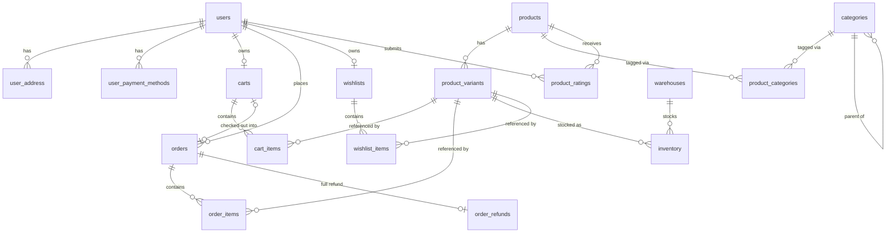

# Database Schema Documentation

## Overview

Schema is managed via Flyway migrations. Flyway is the single source of truth
for the database structure — JPA/Hibernate is configured with
`ddl-auto: validate` and never generates or alters schema itself.

Currently in dev mode: existing migrations may still be edited in place
(database is recreated from scratch). Once the project moves to a
staging/production-like environment, migrations become append-only —
schema changes must be new `V{n}__...sql` files instead.

## Migration Files

| File | Tables Created | Depends On |
|---|---|---|
| `V0__init_functions.sql` | — (defines `set_updated_at()` trigger function) | — |
| `V1__create_users.sql` | `users`, `user_address`, `user_payment_methods` | `V0` (trigger function) |
| `V2__create_products.sql` | `products`, `product_variants` | `V0` |
| `V3__create_carts.sql` | `carts`, `cart_items` | `V1` (users), `V2` (product_variants) |
| `V4__create_payments.sql` | `orders`, `order_items` | `V1` (users), `V2` (product_variants) |
| `V5__create_categories.sql` | `categories`, `product_categories` | `V2` (products) |
| `V6__create_inventory.sql` | `warehouses`, `inventory` | `V2` (product_variants) |
| `V7__create_wishlist.sql` | `wishlists`, `wishlist_items` | `V1` (users), `V2` (product_variants) |
| `V10__account_deletion.sql` | `users` deletion retry/completion flags | `V1` (users) |
| `V11__payment_result_correlation.sql` | `payment_result_receipts` | `V4` (orders), `V9` (payment_outbox) |
| `V12__guest_carts.sql` | guest cart fields/constraints and `guest_cart_merge_receipts` | `V3` (carts), `V1` (users) |
| `V13__checkout_orders.sql` | checkout requests, guest orders and immutable snapshots | `V4`, `V12` |
| `V14__order_cancellation_refunds.sql` | financial/release markers, cancellation receipts, order refunds | `V4`, `V9`, `V11`, `V13` |
| `V15__product_ratings.sql` | `product_ratings` | `V0`, `V1` (users), `V2` (products) |

Every foreign key either points to a table created in an earlier migration
file, or to a table created earlier within the same file. There are no
forward references.

## Entity Relationship Diagram



## Tables

### Guest ownership and merge receipts (V12)

`carts.user_id` is nullable only for a guest cart with `guest_credential_hash`
and `guest_expires_at`. A check constraint excludes simultaneous user/guest
ownership or an ownerless cart. Existing per-user cart and per-cart variant
uniqueness remain; guest hashes are unique and expiration is indexed.
Raw guest credentials are never stored.

`guest_cart_merge_receipts` uniquely binds `(user_id, request_id)` and the
consumed source cart/hash to a durable per-line quantity summary. The source
ID deliberately has no foreign key: successful merge deletes the guest cart
in the same transaction while keeping the replay receipt. Account deletion
explicitly removes receipts; bounded scheduled cleanup removes expired carts
(with cascading items) and receipts. Guest CRUD/merge do not reserve inventory.
See [Guest Cart](../api/guest-cart.md) for expiry, locking and retry semantics.

### users / user_address / user_payment_methods
Core account data. A user has zero or more addresses and saved payment
methods. `users.role` is a native Postgres enum (`admin`, `user`, `support`).

### products / product_variants
`products` holds the shared identity of an item (name, description).
`product_variants` holds the purchasable SKUs — price, physical attributes
(`weight_grams`, `barcode`), and free-form `attributes` (`jsonb`, GIN-indexed)
for category-specific specs like color or size that don't warrant dedicated
columns. `is_active` allows soft-disabling a variant without deleting it.

Stock is **not** tracked here — see `inventory`.

### product_ratings (V15)

One integer `stars` value (1-5, database-checked) per `(product_id, user_id)`.
The composite primary key deduplicates owners and indexes per-product
aggregation; an additional user index supports account cleanup. Both foreign
keys cascade on physical deletion. Creation/update timestamps follow the
existing database trigger convention.

The self-service rating transaction locks the active canonical user and uses
`INSERT ... ON CONFLICT ... DO UPDATE`; duplicate submissions update, never add
another vote. Normal account deletion removes ratings before anonymization.
Product average/count are computed directly from these rows rather than stored
on `products`, eliminating lost/stale counter updates under concurrent writes.
No review text, helpful votes, eligibility/purchase flag or seed ratings are added.
See [P1 rating API](../api/graphql-schema.md#p1-product-ratings-78).

### categories / product_categories
`categories` is self-referencing (`parent_id`) to support arbitrary-depth
sub-categories rather than a fixed two-level split. `product_categories` is
the many-to-many join between products and categories.

Hierarchy mutations acquire PostgreSQL's transaction-scoped
`SHARE ROW EXCLUSIVE` table lock before reading ancestors. This serializes
create/update/delete decisions (including concurrent opposite reparenting)
while leaving ordinary reads available. Self/descendant parenting and
already-cyclic parent chains are rejected before commit. Category mapping
uses iterative traversal and reports the repeated category id instead of
recursing indefinitely or silently truncating a corrupt hierarchy.

**Existing-cycle policy:** do not automatically change shared catalog data.
An administrator can detect affected ancestor chains with this read-only,
bounded query:

```sql
WITH RECURSIVE ancestors AS (
    SELECT id AS start_id, id, parent_id, ARRAY[id] AS path, false AS cycle
    FROM categories
    UNION ALL
    SELECT a.start_id, c.id, c.parent_id, a.path || c.id, c.id = ANY(a.path)
    FROM ancestors a
    JOIN categories c ON c.id = a.parent_id
    WHERE NOT a.cycle
)
SELECT start_id, path FROM ancestors WHERE cycle;
```

Repair requires an explicit, reviewed choice of the incorrect parent link:
record the affected ids/links, acquire the same hierarchy table lock in a
maintenance transaction, and detach that approved link (`parent_id = NULL`)
or replace it with a verified acyclic parent. Rerun detection before commit.
Preserve category ids and product membership; do not delete/reseed categories
or rewrite applied Flyway migrations to hide corrupt data.

### carts / cart_items
A user's in-progress selection before checkout. `carts.user_id` is unique;
checkout clears and reuses that cart rather than creating a new cart per
order. `cart_items` has unique `(cart_id, product_variant_id)` membership.
Lazy cart creation uses a separate `REQUIRES_NEW` transaction. It locks the
canonical user, rejects deleting/deleted accounts, and rechecks the cart before
inserting. Wishlist creation follows the same lifecycle guard. Checkout and
cart mutations validate/lock the user before locking the cart, so deletion
cannot reserve an account midway through an accepted write. Existing personal
aggregates are denied to inactive owners; retained order history remains
accessible to authorized staff. A valid self-contained JWT does not override
these data-state checks.

Add/update/remove/clear and checkout acquire the owning cart's
`PESSIMISTIC_WRITE` lock before reading its items and retain it until the
entire operation commits. Thus overlapping additions merge quantities and
checkout cannot erase an addition that serialized after its snapshot.

### orders / order_items / order_refunds
Checkout migration V13 adds nullable guest ownership, immutable JSONB
order/item snapshots and globally unique `checkout_requests`. Source-cart
coordinates intentionally have no FK because consumed guest carts are deleted.
Guest grants store only hashed independent credentials and absolute expiry;
request identities remain durable after access expires. Legacy missing
addresses/shipping/product details remain unknown, never backfilled from live
data. See [Checkout API](../api/checkout.md) for transaction/lock and deployment
rules.

The actual purchased items are snapshotted into `order_items`
(quantity + `price_at_purchase` and original inventory allocation) at checkout
time, so later price changes on `product_variants` never affect order
history. `orders.total_amount` is stored directly rather than derived via
`SUM(order_items)`, since order total is an immutable historical fact and
this avoids a join on every order-list query.

Payments are owned by the Go service. V14's `orders.payment_status` is a
correlated projection (PENDING/UNRESOLVED/SUCCEEDED/FAILED/UNKNOWN), not authority
to invent or assign a provider outcome. Cancellation receipts bind request UUID,
target and authorized actor/grant. `inventory_released_at` is irreversible and
commits with original-allocation restoration. `order_refunds` binds one immutable
full refund to the original successful payment/request, with a stable refund
UUID and correlated result. Database triggers protect release markers, payment
identity/finality, cancelled-order terminality and refund parameters/finality.
Paid historical cancellations with proven receipts enqueue one refund; missing
financial evidence remains UNKNOWN. See [Order cancellation](../api/order-cancellation.md)
for rollout and original-result replay.

Status transitions lock the order row before validating its current state.
Cancellation and exact-warehouse restoration commit or roll back together;
duplicate/late cancellation cannot restore inventory twice. Subscription
notifications are emitted only after the transition transaction commits.

Payment results must match the persisted `payment.requested` event id and
order id. Processing locks the order first, then that outbox request, and records a
`payment_result_receipts` row in the same transaction as the order transition
and any restoration. Each request has one immutable outcome/payment binding;
payment ids and result event ids cannot be reused for another request.
Duplicates with the same request/payment/outcome are no-ops. Unknown or
mismatched identities leave order/stock unchanged; malformed required fields,
unknown JSON fields (including an unrecognized `status`), and blank decline
reasons go through the existing bounded retry/dead-letter path.

The unchanged wire protocol has no separate result `status`: the
`payment.succeeded`/`payment.failed` topic and strict event shape determine
the outcome. The Go Payment Service assigns `paymentId`, so the first valid
correlated result binds that id; Spring cannot independently pre-verify a
first payment id or a real charge from the request alone. Results therefore
still rely on a trusted Payment Service/producer boundary. Provider webhook
authentication and financial verification remain separate production-provider
work, not a new synchronous payment action. Request outbox rows and receipts
must be retained together for durable correlation; deleting the request
cascades its receipt. Coordinated account deletion preserves request rows
and receipts with their historical orders.

### warehouses / inventory
Stock is tracked per warehouse. `inventory` has a unique
`(product_variant_id, warehouse_id)` pair — total stock for a variant is the
sum of its rows across warehouses. This replaced the earlier
`product_variants.stock_quantity` column to avoid two sources of truth for
stock once multi-warehouse tracking was introduced.

### wishlists / wishlist_items
One wishlist per user (`UNIQUE` on `user_id` is safe here, unlike carts,
because a wishlist isn't "consumed" by a purchase).

## PostgreSQL test isolation

PostgreSQL-only full-application tests explicitly disable Kafka listener
auto-startup and use an unreachable bootstrap address, rather than inheriting
the development broker/group. Actual messaging integration tests import
`KafkaTestConfiguration` and use its disposable broker. The manual factory
honors `spring.kafka.listener.auto-startup` (default `true`); that switch affects
listeners only, not scheduled outbox producers.

## Known Open Points

- **Native Postgres enums vs JPA**: `user_role`, `payment_status`, and
  `order_status` are native Postgres `ENUM` types. Hibernate's default
  `@Enumerated(EnumType.STRING)` maps to `varchar`, not a native enum, which
  will fail `ddl-auto: validate`. Either map explicitly with
  `@JdbcTypeCode(SqlTypes.NAMED_ENUM)` (Hibernate 6+), or switch these
  columns to `varchar` + `CHECK` constraint for simpler JPA compatibility.
- **`product_variants.attributes` (`jsonb`)**: flexible but unvalidated at
  the DB level — worth enforcing structure at the application layer per
  category if this grows.